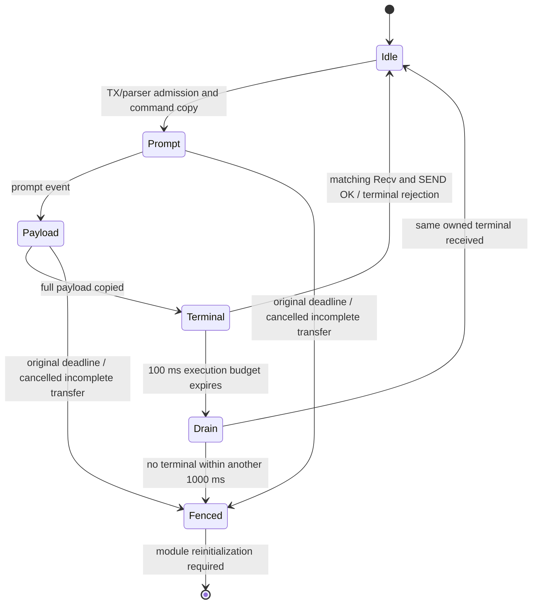

# Radio transaction ownership and Cloud warm recovery

Latest tasks1–2 (2026-10-10): public service availability and bounded CLI reply
ownership are implemented with focused BLE/USB verification. Exact RAM149/149
ordinary finals +39 CRC frames, p95 187/max2797 ms; later whole-run Radio gap266 ms.
Scan admission rejection/local USB continuity proved. Live Cloud approval given
and focused acceptance passed after bounded512-byte sends and async completion
repair:139/139 BLE finals,414 CRC Cloud frames,6/6 matching Cloud completions,
two reconnects1406/4218 ms. UI local/unpublished, Flash/header9. See
[contract and evidence](cli-service-backpressure.md). Tasks3–4 are not started.
The older Cloud/latency failures and checkpoints below remain valid evidence.

2026-10-09 candidate. RAM testing restores real Cloud images through twelve warm
reconnects; combined BLE latency/delivery acceptance still fails. Full
M5.3/M5.4/M5.5 acceptance remains open. Older checkpoints below are retained.
User explicitly prioritized both repairs after the AT lifecycle explanation.

## 2026-10-10 UART debugging follow-up — focused verified

Two diagnostic problems were reproduced in actual-C tests. RX can preempt the
timeout reporter inside UART queue admission: END appears before PENDING, which
previously claimed ownership was still active. The PENDING notice is retained,
but now reports `snapshot=request_timeout`, with elapsed time captured outside
formatting, and describes ownership at that snapshot. It may follow END in the
queue; it does not reopen the wait. No logging lock is added to the RX parser.
Also, expired DNS drain can end with protocol `result=0` despite a true fence.
DNS END now adds `outcome=complete|failed|fenced`, preserving the original result
and fence. Neither fix changes protocol state, budgets, memory capacities or
recovery policy. All diagnostic formatting stays outside interrupt exclusion.

Native diagnostics10 actual-C cases plus Wi-Fi audit pass, including forced
preemption during PENDING and explicit expiry outcome. Notification13, raw21,
association13, request-budget/drain14 with epoch/audits, DNS lifetime/refresh
checks and16 feature compiles pass. The pre-fix failing regression is preserved.

Target, detailed AT trace OFF: preceding candidate411/411 BLE replies,
p95 187.5/max2828 ms, and two reconnects restored actual Cloud frames after IP
in1672/1125 ms. Revised candidate409/409, p95 203/max2672 ms; two reconnects
restored4/3 actual server-received frames in1687/1687 ms. Both runs had zero
missing/duplicate BLE replies; USB pings and ToF stayed alive. UART validation
found6+8 START/END pairs, no unmatched transitions, and durations within20 ms of
HAL timestamps. Final DNS1090/60/70 ms, Wi-Fi connect2097/2159/2159 ms,
disconnect792/532 ms. No late DNS or late BLE terminal was induced on hardware;
fault/preemption diagnostics remain native-test evidence only.

Final UART257 queued/sent, zero dropped/full/contention/transport/HAL errors;
Radio max gap31 ms, allocations zero. Exact-ELF non-halting metadata: fence and
DNS drain false, scan scratch absent, pool3440/fragments37. Observed stack use
Radio1652/8192, control1500/6144, Cloud3584/8192, SPI308/768, parser916/2048.
This is a live non-atomic sample with Cloud requests active, not socket retirement,
endurance or worst-case stack proof. One best-effort Cloud frame drop and one
request error were recorded around disconnect; image return was separately
verified. Long BLE pauses and earlier missing-reply/latency FAILs remain OPEN.

Initial Cloud409 was `workspace_inactive`: closing the diagnostic Hub removes
its workspace from the server registry. Reopening the saved workspace/token
restored actual frames without reset or re-pair. This follows
`Server/N6.CloudRelay/Program.cs` and `RelayRegistry.CloseBrowser/GetDeviceAccess`
in the companion web project. Diagnostic receiver closed after final357 frames;
that workspace will again back off until opened. COM6/COM8 and BLE handles released.

Latest exact RAM ELF SHA:
`10F8C7550385B9734362901FC328F7F3965A144EAD67A759A42988E34467268B`.
Signed-only v10 package471744, NS470464, C heap401688 (minimum368640).
RAM10; Flash/tracked header9. No external NOR write. Prior candidate identities
remain historical. Ignored evidence: `radio-wait/debug/` and `debug-final/`
contain BLE/warm reports, UART validation, exact hashes/ELF, build/native/feature
logs and metadata; `debug-short.log` and `debug-final.log` retain UART captures.
Service availability/CLI admission/backpressure and coordinated true-fence
reinitialization remain separate unfinished work.

## 2026-10-09 UART wait diagnostics — focused verified

User requested start/end timing on the existing diagnostic UART. `RADIO-WAIT`
now reports DNS reply ownership (including normal replies), Wi-Fi Connect and
Disconnect call windows, and a late BLE terminal drain. START supplies reason;
END supplies elapsed milliseconds and result. DNS/BLE END also supplies fence
state; BLE includes cancellation. START/END are transitions, not retry logs.
The pending-DNS request-timeout report is preserved. True fences still stay
closed; END with `fenced=1` means the wait ended in fault, not restored service.
BLE END reports total transaction time, including the original execution budget.
The UART prefix uses HAL uptime; RTOS ticks are converted only for durations,
since the scheduler and HAL absolute clocks have different epochs.

DNS reports retire exactly once even on immediate replies, write failure,
deadline expiry, late replies or repeated admission polls. BLE drain END is
emitted once even if parser-busy retirement takes several Radio iterations.
Formatting remains outside interrupt exclusion and outside the SPI worker;
all messages go through the existing asynchronous UART owner. No credentials,
payloads, task/queue/stack/pool increase, deadline change or protocol fence reset.

Final exact RAM ELF SHA:
`EEB943E97AF4126833B48DE6D57962B8638A9A2A70446C97BD73FF2EE166E0F3`.
Signed v10 package471584, NS binary470296, C heap401848 (minimum368640).
Tracked source/header and Flash9; RAM10. Earlier candidate identities below
remain historical. The first diagnostic build is retained separately; a final
label correction removed confusing RTOS absolute milliseconds from START.

Native diagnostics8 actual-C cases plus Wi-Fi source audit, notification13,
raw21, association13, request-budget/drain14 plus epoch4/audits pass. Feature16
compiles pass. Native tests cover late DNS/expired drain and late BLE/expired
terminal cases; those fault-injection diagnostic cases have not been induced on
the target in this subtask. A UART collector with detailed AT trace disabled
verified10 paired transitions across the two diagnostic RAM boots. Final target
disconnects524/529 ms, reconnects1882/2154 ms, DNS0/140/150 ms (RTOS resolution10 ms).
Final two reconnects returned4 actual Cloud frames each after confirmed IP in
1687/5672 ms. USB stayed responsive and ToF ready. Pool3440/fragments37,
fence/drainfalse, scan scratch absent, six sockets free in the sampled reads.
Observed stacks: Radio1652/8192, control1500/6144, Cloud3592/8192, SPI308/768,
parser980/2048. No concurrent BLE/trace stress in this capture; not worst-case proof.

Ignored evidence: `.local-dependencies/diagnostics/radio-wait/` contains
`uart-wait.log`, `uart-wait-validation.json`, `warm-two.json`, `metadata.json`,
`final-hashes.json`, `candidate-v10-wait-final.elf` and build/loader logs.
Native/feature logs use `radio-recovery/wait-*`. Host handles were released;
device remains in RAM with Wi-Fi/Cloud image destination enabled. Full latency,
reply-delivery, coordinated true-fault recovery and endurance gates remain OPEN.
These logs do not implement public service-state/CLI backpressure or the browser
waiting/error UX. That user-approved policy is the next work, not silently PASSED.

## Notification transaction

The existing Radio task begins/polls/retires one notification. The AT mutex
stays owned by that same task across cycles; other owners cannot write commands.
Begin OK is admission only. Poll BUSY means pending, never resubmission. CLI
slots and the one ToF snapshot keep their offsets until a definite completion.
The driver stores scalars, not borrowed payload/command pointers. Image packets
are reconstructed on the existing stack and copied into bus-owned SPI storage.
The announced packet size is frozen across MTU changes.

The original **100 ms execution budget is unchanged**. After complete payload
submission, a separate **read-only, bounded 1000 ms terminal drain** keeps the
same handlers/mutex. It cannot submit payload or AT text. This pending state
is not an abandoned transaction's protective fence. Once genuinely fenced,
late replies and ordinary retries cannot clear the fence. No uncoordinated
whole-NCP reset is added; reinitialization of a genuinely unresolved shared
transport remains an acceptance requirement, including desired-state restore.

This extension is pinned to the installed SDK 2.0.106 wire contract: generic
OK is command acceptance only; Recv validates length; SEND OK completes. The
original synchronous API still supports the previously observed payload-OK
variant. Notification callbacks signal a distinct bit in the **existing**
control event group. Radio waits on that bit with its original finite periodic
fallback; the control worker uses different masks. No task/event group, queue,
pool, stack or image-buffer capacity is increased.

Cancellation precedes source-slot purge. A complete bus copy can drain its old
result without retaining the source. An incomplete cancelled transfer fences
instead of substituting a new session's bytes. Parser-busy retirement defers
without waiting or unregistering an executing callback.

## Cloud network and socket lifecycle

Network loss publishes an epoch immediately from the bounded Wi-Fi callback;
Radio readiness transitions also advance it. Thus a loss/reconnect wholly
between Cloud worker steps still invalidates the old request. The worker closes
that request, releases its ToF lease, invalidates DNS/backoff/TLS-time state,
and preserves enabled/pairing intent. Old-epoch response bodies cannot commit.
This does not request a new image destination, overriding last-request-wins.

Confirmed defects repaired:

- CLOSING previously fell through Close as success after an earlier failed
  close. The Cloud owner now retains its descriptor and retries at most once
  per second rather than opening another socket. Each close step is scoped to
  500 ms. CLOSED or a successful CIPSTATE query proving remote absence retires
  the connection. ERROR/ACK alone does not prove retirement.
- CIPSTART may reach the NCP before a CONNECTED callback. OpenAttempted keeps
  such an ALLOCATED descriptor in remote cleanup instead of simply freeing it.
- A missing CONNECTED callback after the extra 10 ms used to return the prior
  successful command result. It now returns failure.
- Cleanup used a connection ID as a BSD descriptor index when selecting the
  receive semaphore. It now uses the actual connection ID. Credential pointers
  detach atomically before freeing, preventing callback/owner double retirement.

Receive-buffer setup now queries the **actual NCP connection ID** first. A
confirmed matching size is reused; a different size is explicitly configured.
BUSY/timeout do not trigger another configuration command. A terminal query
ERROR may fall back to configuration, but a rejected configuration is retained
and logged with descriptor, connection ID, requested/observed sizes and result.
Whether redundant NCP allocation caused the earlier CIPRECVBUF ERROR remains
unproven until target measurement. No size is reduced/increased to mask it.

The 4500 ms HTTP deadline starts **before DNS, socket configuration, opening
and sends**. An owner-specific driver scope limits real nested AT lock/reply
waits and SPI queue admission to its remaining budget. Receive waits and direct
network-query/pull locks also consume the remaining budget. Other tasks keep
their own budgets. Epoch changes reject new commands at boundaries; an admitted
command retains its reply ownership. An unanswered scoped AT command fails
closed, rather than allowing its late OK to satisfy a later command. Cleanup
has its separate bounded scope; 4500 ms is not a claim that cleanup is free.

### DNS terminal ownership and pre-write cancellation

Target traces proved DNS replies at 6.610 and 6.744 seconds, beyond the 4500 ms
HTTP request budget. A timed-out scoped ordinary CIPDOMAIN request now returns
TIMEOUT to its caller but retains a read-only terminal drain, bounded by the
SDK's original 20 seconds from command submission. No new AT command is admitted
until the persistent OK/ERROR retires that still-owned reply. Drain expiry
creates a real fence; a late reply never clears a real fence. This is a narrow
DNS exception, not permission to retry an ambiguous raw payload.

DNS query callbacks use a persistent descriptor and a short critical-section
lifetime guard. Returning query calls atomically retire their borrowed result
pointers; a late DNS response cannot write to expired stack storage. Wi-Fi
status refresh defers during the drain and retries once per second from the
existing worker on every wake path, including BLE wakes. Failed queries do not
overwrite the last confirmed IP shadow. No new task, queue or event group.

A separate target failure showed CIPSEND falsely fenced after CWQAP: the Cloud
owner waited for AT, the disconnect callback advanced its epoch, and command
admission returned TIMEOUT **before any CIPSEND byte was written**. Raw code had
marked the announcement before calling admission. It now uses an explicit
TX-owner-only bus-attempt outcome. Pre-write rejection preserves TIMEOUT without
a false fence; partial writes and unanswered transmitted commands remain fenced.
Bus EBUSY is the documented zero-byte exception. A fresh BLE notification also
defers while the existing Wi-Fi worker is inside Connect; an already-owned
notification continues to drain. The 100 ms submission budget is unchanged.

## Verification and remaining target work

### Latest 2026-10-09 RAM checkpoint

Exact candidate `candidate-v10-cancel.elf` SHA-256:
`DD1188A91DEC41A5CB8FE8BBF515B011E3D8A2C325061DD746652ED39452E0EE`.
NS binary 469704 bytes, signed package 471008 bytes, C heap 402424 bytes
(minimum 368640). Radio pool remains 65536; no task/queue/stack capacity grew.
Flash/tracked source remains v9; tested Debug ELF is v10. No Generate Code.

Six trace-on warm Wi-Fi loss/reconnect cycles delivered new **server-received**
Cloud frames in 1719, 2782, 1672, 1688, 1704 and 5032 ms after confirmed IP.
The receiver verified active CLOUD routing first; IP events alone were not the
success criterion. USB PONGs continued, Radio/BLE max loop gap 23 ms, allocation
failures zero, ToF ready without recovery attempts. Cloud max step 4500 ms.
Combined BLE probe **FAILED**: 621/622 replies, one missing, p95 312 ms,
maximum 9188 ms, zero reconnects. A trace-off repeat restored actual Cloud frames
through six further reconnects in 1672,1672,1110,4015,1688,1125 ms, but BLE
again **FAILED**: 614/615, one missing, p95 297/max 9219 ms, zero reconnects.
Radio/BLE gap remained23 ms, allocation failures zero. CLI TX high-water8/8
and drops increased by one during each run; DNS drain retained shared AT.
These are focused Cloud recovery passes, not full radio latency acceptance.
Increasing slots/pool or clearing drain ownership is not an accepted remedy.

The exact same candidate passed exclusive CRC routing:20 BLE frames,25 USB,
then20 BLE, with no continued BLE image packets during USB ownership and Cloud
accepted-image counter stopped during BLE/USB. One passing route repeat does
not erase the older missing-terminal failure or prove endurance.

Non-halting exact-ELF capture after reconnects: AT fence false, DNS drain false,
notification phase idle, scan scratch absent, pool 3440 bytes /37 fragments.
Observed sentinel use: Radio 1844/8192, Wi-Fi control 1732/6144, Cloud 3592/8192,
SPI 308/768, parser 1288/2048. These are observations, not worst-case guarantees.
Socket fields read in several non-halting commands can straddle a live opening;
the active snapshot is retained as `cancel-active-metadata.json`. A subsequent
quiescent capture with Cloud disabled found all six sockets FREE, NCP IDs6
(invalid sentinel), no OpenAttempted/credential pointers; fence/drain false,
scan scratch absent, pool3440/fragments38, same observed stack use. No retained
socket growth was found after these12 reconnects; this is not an endurance proof.
Finally Cloud was re-enabled and MAP ON sent through Cloud CLI; six new actual
server frames were verified, ToF ready, Radio gap23 ms and allocation failures0.
UART/USB/BLE host handles and the diagnostic receiver were then released.
The device remains running v10 in RAM with Wi-Fi/Cloud enabled; Flash is v9.
Final evidence: `cancel-final-off.json`, `cancel-final-on.json`,
`cancel-diff-check.log` (exit0). The diagnostic workspace can be imported from
the ignored `diagnostic.n6workspace.json`; it is test state, not a tracked asset.

Native checks pass: raw 21, association 13, notification transaction 13,
route/diagnostic/association guard 6 plus source audit, socket 9, budget/drain 14,
Cloud epoch 4 plus wrapper audit; DNS callback lifetime 3 and Wi-Fi refresh 1,
plus two source audits. Feature-mode syntax matrix 16/16.

Evidence (ignored `.local-dependencies/diagnostics/radio-recovery/`):
`cancel-cloud-six.json`, `ble-cloud-cancel.json`, `cancel-wire.log`,
`cancel-metadata.json`, `cancel-hashes.json`, `cancel-feature.log` and test logs.
Quiet/route evidence: `cancel-cloud-quiet-six.json`,
`ble-cloud-cancel-quiet.json`, `cancel-exclusive-route.json`.
Preserve earlier DNS failures, fifth/sixth reconnect BLE-prompt failure and
`guard-cloud-six.json`/`ble-cloud-guard.json` false-CIPSEND-fence run. Windows may
restore the ToF CCCD on BLE connect; reassert MAP ON through the actual Cloud CLI
and verify the route before testing Cloud reception. USB `cloud map on` is not
a valid route command. Host-precondition failures remain recorded separately.

Still required: BLE latency/delivery repair under pending DNS/association,
worst-stack/endurance, and coordinated recovery of
a genuinely missing shared-NCP reply. Do not install v10 in Flash before target
acceptance or mark the whole milestones complete.

### Earlier 2026-10-09 target checkpoint — retained failures

The first exact candidate (`candidate-v10.elf`, SHA-256
`AFFA8A1C76A2DC356D2BD860C4B32ED4806D0A0DBFE054001EB1BF64FBE543B0`)
was loaded through the proper FSBL/Secure handoff into RAM. Three Wi-Fi
reassociation cycles over 150 seconds delivered 381/381 BLE replies, 115/115
USB replies and 92 CRC-valid BLE images. Radio/BLE loop maximum was 22 ms,
allocation failures zero. BLE p95 **1469 ms**, maximum **1610 ms**: this is a
latency FAIL, despite complete delivery. Evidence: ignored
`Tools/.n6-debug/radio-stability-20261008/async-v10-assoc*.json`.

Actual Cloud reception then delivered 170 images before a separate warm-loss
probe. The first reconnect emitted CONNECTED/address-acquired events, but DNS
timed out at the scoped 4500 ms deadline and later AT operations failed closed.
USB and ToF stayed alive; actual Cloud return FAILED. IP events alone are not
Cloud recovery proof. Keep the exact failure in
`.local-dependencies/diagnostics/radio-recovery/warm.json` and
`cloud-hil/ram-uart.log`; a missing-response recovery design is still required.

UART revealed an implementation mistake in diagnostic classification: expected
Begin/Poll/Cancel BUSY was counted and printed as an error on every cycle.
The original notification exclusion now covers all four notification APIs.
A fifth production-C route/diagnostic check verifies that actual errors and
non-notification BUSY remain visible. This is a confirmed logging repair,
**not yet proof of the cause of BLE latency**.

The corrected v10 rebuilt/signed successfully: NS 468960 bytes, package 470240,
C heap 403200; pool/queues/stacks unchanged. Sixteen feature-mode compiles pass.
Exact ELF is preserved as `candidate-v10-quiet.elf` with SHA-256
`C94B88C4C46F8DB8A1240E2CF4E145B56349944EC31544FA323F2D5C27927F20`.
A warm RAM reload reached firmware/USB/radio startup but ToF initial dynamic
I3C address assignment failed; this prevents any image acceptance from that
run. A brief full power removal was requested before clean-candidate testing.
The follow-up trace's expired pairing-code 404 is a host-test failure, not a
Cloud warm recovery result. Flash and tracked source remain v9.

New production-C checks: notification transaction 13, Radio source/MTU/route
ownership/diagnostics 5 plus source audit, socket lifecycle/configuration 9, request-budget
admission 7, Cloud warm-epoch behavior 4 plus request-wrapper audit. Existing
raw 20, association 11, scan lifetime/admission 16 and control ownership 13
checks pass. Enabled/disabled feature syntax matrix: 16/16.

Earlier signed candidate: `FlashImages/N6-Firmware-v10.n6fw`, package 470240 bytes,
NS binary 468960 bytes. C heap 403200 bytes (minimum 368640), radio pool still
65536. Source/release header and installed Flash remain v9. PackageOnly did not
program hardware. The Debug ELF currently represents the signed v10 candidate;
match it exactly when diagnosing RAM. No Generate Code is required.

Compiler frames observed: NotifyBegin 48, NotifyPoll 40, NotifyCancel 24 and
socket cleanup 80 bytes. These are individual frames, not task high-water or
worst-case call-chain proof. Existing SPI scalar-only diagnostics are unchanged.

Earlier next step (now executed, with latest results above): after full power removal, load the corrected candidate into RAM through proper Secure/Non-Secure handoff,
capture UART, measure BLE/USB replies and CRC frames, repeat exclusive routes,
then repeated Wi-Fi loss/reconnect with real server-received Cloud frames.
Require p95 BLE <=250 ms, Radio/BLE gap <=500 ms, no missing replies, no stale
completion, no allocation/socket growth, and Cloud image return <=20 seconds.
Retain failed attempts; none of the earlier HIL failures is superseded by these
native PASS results. Do not install v10 in Flash before target acceptance.
